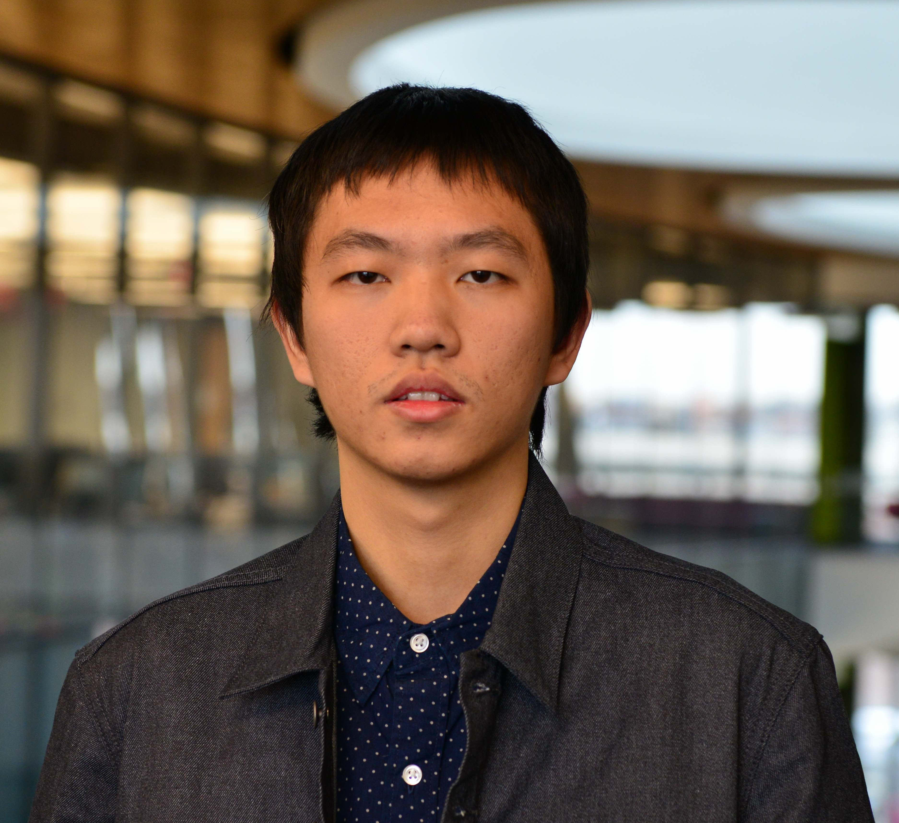
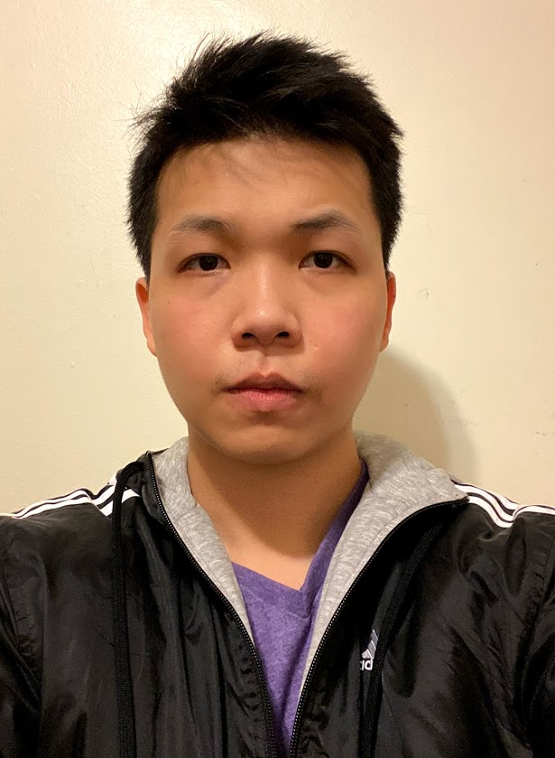

<!-- 
 -->
# 
 PIs 

<!-- 
 -->
<table>
  <tr>
    <td style="vertical-align: middle;">
      
    </td>
    <td style="vertical-align: top; padding-left: 24px; word-break: break-all;">
      <h2 style="font-size:1.8em; margin:0;">Edmund Yeh </h2>
      

        PI 
        Professor and Chair 
        Electrical and Computer Engineering Department 
        Khoury School of Computer Sciences (Courtesy Appointment) 
        Northeastern University 
        <a href="mailto:eyeh@ece.neu.edu">eyeh@ece.neu.edu</a> 
        <a href="https://www1.ece.neu.edu/~eyeh/" target="_blank">Homepage</a>
      

    </td>
  </tr>
</table>
<table>
  <tr>
    <td style="vertical-align: middle;">
      
    </td>
    <td style="vertical-align: top; padding-left: 24px; word-break: break-all;">
      <h2 style="font-size:1.8em; margin:0;">Dimitrios Koutsonikolas </h2>
        

        Co-PI 
        Associate Professor 
        Electrical and Computer Engineering Department 
        Institute for the Wireless Internet of Things 
        Northeastern University 
        <a href="mailto:d.koutsonikolas@northeastern.edu">d.koutsonikolas@northeastern.edu</a> 
        <a href="https://ece.northeastern.edu/fac-ece/dkoutsonikolas/" target="_blank">Homepage</a>
      

    </td>
  </tr>
</table>
<table>
  <tr>
    <td style="vertical-align: middle;">
      
    </td>
     <td style="vertical-align: top; padding-left: 24px; word-break: break-all;">
      <h2 style="font-size:1.8em; margin:0;">Mai Vu </h2>
        

        Co-PI 
        Professor 
        Electrical and Computer Engineering Department 
        Computer Science Department, Secondary appointment 
        Co-Director, BS and MS programs in Data Science 
        School of Engineering 
        Tufts University 
        <a href="mailto:mai.vu@tufts.edu">mai.vu@tufts.edu</a> 
        <a href="https://www.ece.tufts.edu/~maivu/" target="_blank">Homepage</a>
      

    </td>
  </tr>
</table>

<!-- 





 -->

# 
Students

<!-- 
 -->
<table>
  <tr>
    <td style="vertical-align: middle;">
      
    </td>
    <td style="vertical-align: top; padding-left: 24px; word-break: break-all;">
      <h2 style="font-size:1.8em; margin:0;">Yuanhao Wu </h2>
        

        Graduate Student (research assistant) 
        Electrical and Computer Engineering Department 
        Northeastern University 
        <a href="mailto:wu.yuanh@northeastern.edu">wu.yuanh@northeastern.edu</a> 
        <!-- <a href="https://scholar.google.com/citations?user=lZ3RXAcAAAAJ&hl=en" target="_blank">Homepage</a> -->
      

    </td>
  </tr>
</table>
<table>
  <tr>
    <td style="vertical-align: middle;">
      
    </td>
    <td style="vertical-align: top; padding-left: 24px; word-break: break-all;">
      <h2 style="font-size:1.8em; margin:0;">Phuc Dinh </h2>
        

        Graduate Student (research assistant) 
        Electrical and Computer Engineering Department 
        Northeastern University 
        <a href="mailto:dinh.p@northeastern.edu">dinh.p@northeastern.edu</a> 
        <!-- <a href="https://ece.northeastern.edu/fac-ece/dkoutsonikolas/" target="_blank">Homepage</a> -->
      

    </td>
  </tr>
</table>
<table>
  <tr>
    <td style="vertical-align: middle;">
      
    </td>
     <td style="vertical-align: top; padding-left: 24px; word-break: break-all;">
      <h2 style="font-size:1.8em; margin:0;">Qing Lyu</h2>
        

       Graduate Student (research assistant) 
        Electrical and Computer Engineering Department 
        Tufts University 
        <a href="mailto:qing.lyu@tufts.edu ">qing.lyu@tufts.edu </a> 
        <!-- <a href="https://www.ece.tufts.edu/~maivu/" target="_blank">Homepage</a> -->
      

    </td>
  </tr>
</table>

<!-- {: .align-left} The rest of this paragraph is filler for the sake of seeing the text wrap around the 150×150 image, which is **left aligned**. -->